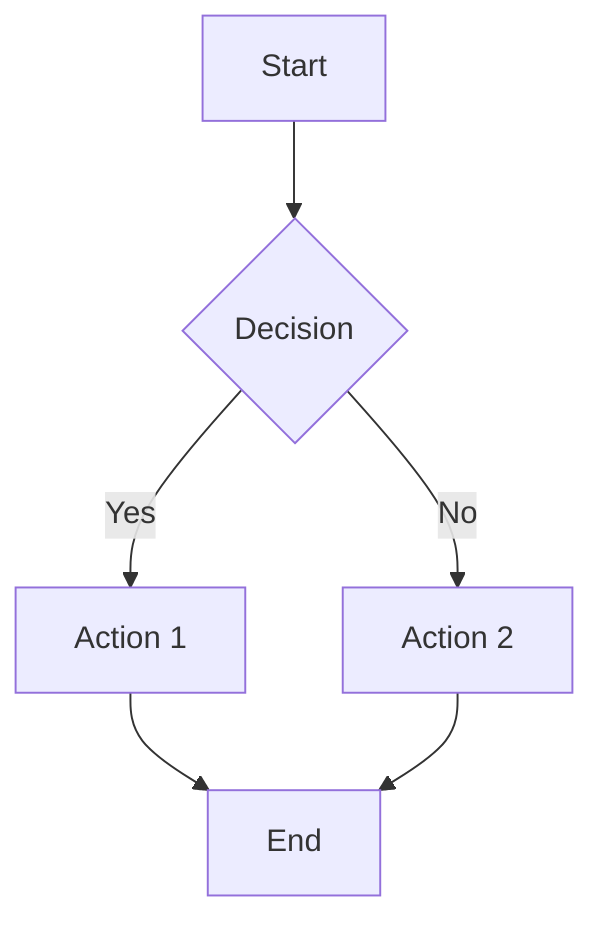
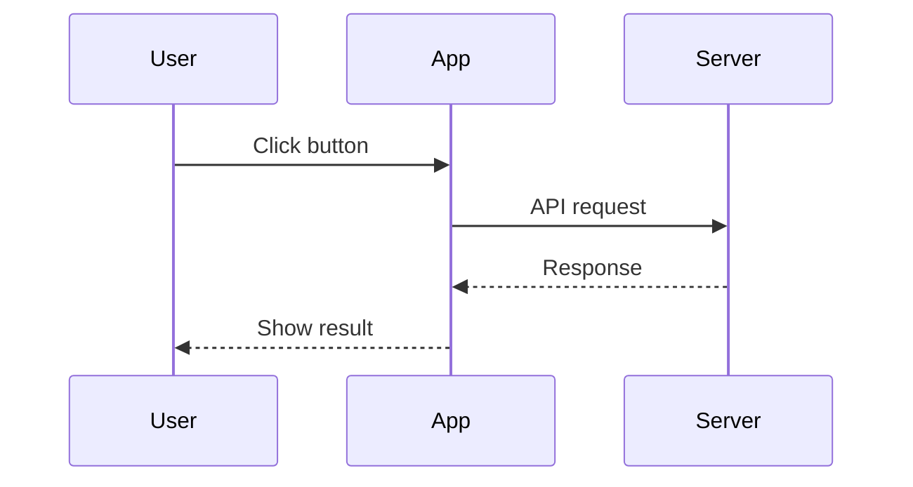

# Cupertino Theme Showcase

이 문서는 Cupertino 테마에서 지원하는 마크다운 컴포넌트를 모아놓은 레퍼런스입니다. 글 작성 시 참고용으로 사용하세요.

---

## Headings

# Heading 1
## Heading 2
### Heading 3
#### Heading 4
##### Heading 5
###### Heading 6

---

## Text Formatting

**Bold text** / *Italic text* / ***Bold and italic***

~~Strikethrough~~ / ==Highlighted text== / `Inline code`

> [!tip] Tip
> `==텍스트==` 로 하이라이트, `~~텍스트~~` 로 취소선을 적용합니다.

---

## Links

[[showcase|Internal link]] / [External link](https://obsidian.md)

---

## Blockquotes

> This is a simple blockquote.

> Nested blockquotes work too.
>> Like this second level.
>>> And a third level.

---

## Lists

### Unordered List
- First item
  - Nested item
    - Deep nested
- Second item
- Third item

### Ordered List
1. First step
2. Second step
   1. Sub-step A
   2. Sub-step B
3. Third step

### Task List (기본)
- [ ] To-do item
- [x] Completed item
- [/] Incomplete / in-progress
- [-] Canceled item

### Task List (확장 체크박스)

Cupertino는 Minimal 테마의 확장 체크박스를 지원합니다:

- [>] Forwarded
- [<] Scheduled
- [?] Question
- [!] Important
- [*] Star
- ["] Quote
- [l] Location
- [b] Bookmark
- [i] Information
- [S] Savings
- [I] Idea
- [p] Pros
- [c] Cons
- [f] Fire
- [k] Key
- [w] Win
- [u] Up
- [d] Down

---

## Callouts

> [!note] Note
> 기본 노트 callout입니다.

> [!tip] Tip
> 유용한 팁을 작성할 때 사용합니다.

> [!warning] Warning
> 주의가 필요한 내용에 사용합니다.

> [!danger] Danger
> 위험하거나 중요한 경고에 사용합니다.

> [!info] Info
> 정보성 내용을 전달할 때 사용합니다.

> [!question] Question
> 질문이나 FAQ에 사용합니다.

> [!success] Success
> 성공 또는 완료 상태를 표시합니다.

> [!failure] Failure
> 실패 또는 오류를 표시합니다.

> [!bug] Bug
> 버그 리포트에 사용합니다.

> [!example] Example
> 예시를 보여줄 때 사용합니다.

> [!abstract] Abstract / Summary
> 요약 내용을 작성할 때 사용합니다.

> [!quote] Quote
> 인용문에 사용합니다.

### 접을 수 있는 Callout

> [!tip]- 클릭하면 접힙니다
> 이 내용은 접을 수 있습니다. 제목 뒤에 `-`를 붙이면 됩니다.

> [!note]+ 기본 펼침 상태
> `+`를 붙이면 기본적으로 펼쳐진 상태에서 접을 수 있습니다.

### Banner Icon Callout

> [!banner-icon] 🌱
> Cupertino 테마 전용. 노트 상단에 이모지 아이콘을 표시합니다.

---

## Tables

### 기본 테이블

| Column A | Column B | Column C |
|----------|----------|----------|
| Row 1    | Data     | Value    |
| Row 2    | Data     | Value    |
| Row 3    | Data     | Value    |

> [!tip] 테이블 CSS 클래스
> frontmatter에 `cssclasses`를 추가해서 테이블 스타일을 변경할 수 있습니다:
> - `table-lines` — 모든 셀에 보더
> - `row-lines` — 행 사이 보더
> - `col-lines` — 열 사이 보더
> - `row-alt` — 줄무늬 배경 (짝수행)
> - `col-alt` — 줄무늬 배경 (짝수열)
> - `table-small` / `table-tiny` — 작은 폰트
> - `table-numbers` — 행 번호 추가
> - `table-nowrap` — 줄바꿈 비활성화
> - `table-wide` / `table-max` / `table-100` — 테이블 너비 확장

### 정렬

| Left-aligned | Center-aligned | Right-aligned |
|:-------------|:--------------:|--------------:|
| Left         |     Center     |         Right |
| Text         |     Text       |          Text |

---

## Code Blocks

### Inline
Use `console.log()` to debug.

### Block

```javascript
function greet(name) {
  return `Hello, ${name}!`;
}

console.log(greet("World"));
```

```python
def fibonacci(n):
    a, b = 0, 1
    for _ in range(n):
        yield a
        a, b = b, a + b

print(list(fibonacci(10)))
```

```css
.container {
  display: flex;
  align-items: center;
  gap: 1rem;
}
```

---

## Images

### 기본 이미지
``

### 이미지 크기 조절
`` — 너비 300px

### 이미지 필터 (Cupertino/Minimal)
- `` — 원형 크롭
- `` — 외곽선 추가
- `` — 다크모드에서 반전
- `` — 라이트모드에서 반전

> [!tip] 이미지 너비 CSS 클래스
> frontmatter `cssclasses`에 추가:
> - `img-100` — 이미지가 100% 너비
> - `img-max` — 최대 줄 너비 (88%)
> - `img-wide` — 넓은 줄 너비

---

## Math (MathJax)

### Inline
The formula $E = mc^2$ is well known.

### Block
$$
\int_0^\infty e^{-x^2} dx = \frac{\sqrt{\pi}}{2}
$$

$$
\begin{bmatrix}
a & b \\
c & d
\end{bmatrix}
\times
\begin{bmatrix}
e \\
f
\end{bmatrix}
=
\begin{bmatrix}
ae + bf \\
ce + df
\end{bmatrix}
$$

---

## Footnotes

Here is a sentence with a footnote.[^1] And another one.[^2]

[^1]: This is the first footnote content.
[^2]: This is the second footnote with **bold** and `code`.

---

## Horizontal Rules

위의 각 섹션 사이에 `---`로 구분선을 사용했습니다.

---

## Tags

#showcase #reference #cupertino

---

## Mermaid Diagrams





---

## Embeds / Transclusions

다른 노트를 임베드할 때: `![[note-name]]`

> [!tip] Embed CSS 클래스
> - `embed-strict` — 배경 제거, 텍스트에 자연스럽게 삽입
> - `embed-hide-title` — 임베드 제목 숨김

---

## Block Width Classes

frontmatter `cssclasses`에 추가하여 콘텐츠 너비를 조절합니다:

| Class | Effect |
|-------|--------|
| `wide` | 넓은 콘텐츠 영역 |
| `max` | 최대 너비 콘텐츠 |
| `img-100` | 이미지 100% 너비 |
| `table-100` | 테이블 100% 너비 |
| `img-max` | 이미지 최대 너비 |
| `table-max` | 테이블 최대 너비 |
| `img-wide` | 이미지 넓은 너비 |
| `table-wide` | 테이블 넓은 너비 |

---

## Cards Layout

Dataview 테이블을 카드 형태로 표시합니다. frontmatter에 `cssclasses: cards`를 추가하세요.

### 사용 가능한 카드 클래스

| Class | Effect |
|-------|--------|
| `cards` | 카드 레이아웃 활성화 (필수) |
| `cards-cover` | 이미지가 지정된 공간을 채움 |
| `cards-align-bottom` | 마지막 요소를 하단 정렬 |
| `cards-16-9` | 16:9 비율 |
| `cards-1-1` | 1:1 정사각형 비율 |
| `cards-2-1` | 2:1 비율 |
| `cards-2-3` | 2:3 비율 |
| `cards-cols-1` ~ `cards-cols-8` | 열 수 지정 |

### 예시 frontmatter

```yaml
---
cssclasses:
  - cards
  - cards-cover
  - cards-cols-3
  - cards-1-1
---
```

---

## Banner

노트 상단에 배너 이미지를 표시합니다.

```yaml
---
cssclasses:
  - banner
  - banner-fade
---
```

| Class | Effect |
|-------|--------|
| `banner` | 배너 이미지 활성화 |
| `banner-fade` | 배너에 페이드 효과 |
| `banner-icon` | 배너 아이콘 표시 |
| `banner-title` | 배너 위에 제목 표시 |
| `y0` ~ `y100` | 배너 이미지 Y축 위치 (5단위) |

---

## cssclasses 조합 예시

```yaml
---
cssclasses:
  - wide
  - table-lines
  - row-alt
  - img-grid
---
```

여러 클래스를 조합해서 페이지별로 다른 레이아웃을 만들 수 있습니다.
